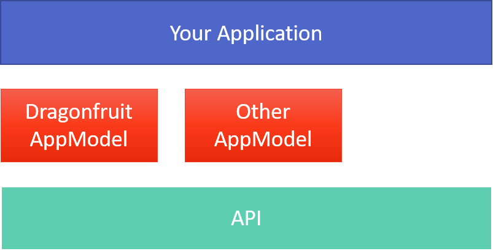

# Welcome to the System.CommandLine wiki!

## Our goal

_Give your user's a great experience with your .NET command line applications - while you do nothing or almost nothing_

## Overview

To do this System.CommandLine contains three pillars of functionality: 

1. Parse command line/terminal input
2. Render output to multiple terminals (VT100, Windows Console and downlevel consoles)
3. Offer common operations via a pipeline, including suggestions, help, exception handling, and parse debugging

## Parsing

System.CommandLine is a layered system with an API layer that supports multiple application models to simplify working with the parser. You can also work directly with the underlying API. 

[[/images/AppModels.png|Layer Diagram]]

The simplest way to create your parser is with the [DragonFruit app model](DragonFruit). This works well if you have a single layer of commands (no subcommands). This approach adds a target to the build process. 

If you have a complex API, or you want to work with the API directly to better understand it, you can access the [System.CommandLine API](Using-The-API) directly. 

We plan to add application models to fit niches between DragonFruit and direct API access in the future.

## Rendering

## Pipeline operations
